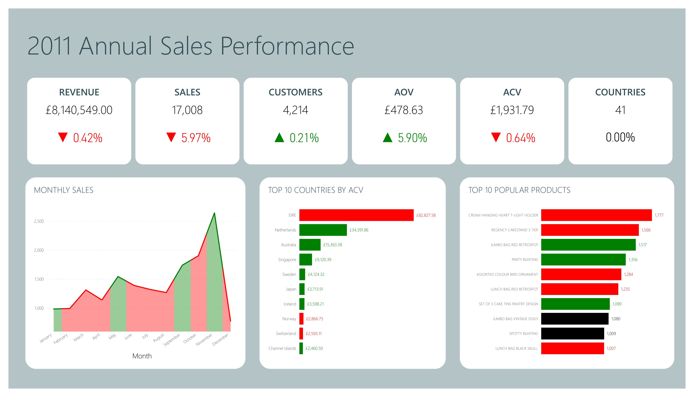
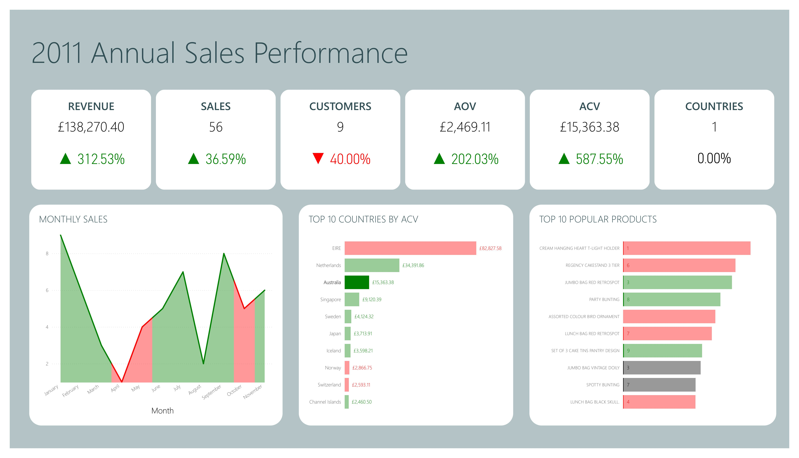

# Online Retail Sales Performance Analysis

### **Key Insights**

- Gross revenue stayed roughly the same although there is a significant decrease in sales.
- Ireland still provides the highest value per customer, but experiences a decrease from the previous year.
- Australia shows the biggest improvement in sales performance, providing 3 times the revenue, 2 times the average order value, and 6 times the average customer value compared to the previous year.
- Months near the start of UK summer, UK autumn, and the holiday season experience and increase in sales, and a decrease otherwise.
- The most popular product isthe cream hanging heart T-light holder, with 1,777 units sold, followed closely by by the 3-tier regency cakestand at1,566 units sold.

This sales performance dashboard uses the Online Retail II dataset via UCI. The data was validated and loaded into customer, product, and invoice tables respectively in a PostgreSQL database, connected via foreign keys.

KPIs such as average order value and average customer value, as well as year-on-year change in revenue, were calculated dynamically via Power BI DAX. Since this dataset only covers two full years of data (2010 \& 2011), therefore I framed this as an annual sales report for the year 2011, comparing against 2010. Red in the visuals indicates a decrease from 2010, and green indicates an increase.

Clicking on the charts allows users to filter based on month, country, or product. For example, selecting Australia gives the KPIs specific to Australian customers, as shown below.

