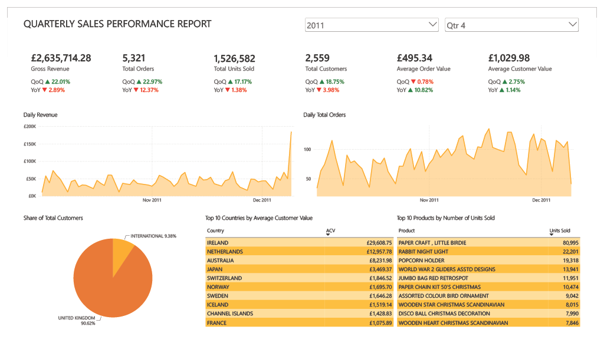

# British Online Retail Quarterly Sales Performance Report

### **Dashboard Snapshot**

### **Key Insights for Q4 2011**
- Gross revenue, total orders, total units sold, and total customers all experienced a significant increase from last quarter, but a slight decrease from last year. For instance, gross revenue increased by 22% from last year, but decreased by 2.8% from last year. Hence, the increase from last quarter might just be a seasonal trend.
- The average order value, on the contrary, decreased slightly (-0.8%) from last quarter, but increased significantly from last year (+10.82%).
- The average customer value increased slightly compared to both last quarter (+2.8%) and last year (+1.1%).
- The decrease in sales compared to last year despite the increase in both the value per order and the value per customer indicates that the business strategy for next quarter is to  either acquaring new customers, or incentivise existing customers to use the business more frequently, ideally both.
- Since most of the existing customer base is domestic (91%), expanding the international customer base can improve performance. Ireland and the Netherlands, both neighbours of the UK ranks the top in average customer value. Therefore, not only that the cost of customer acquisition will be lower due to proximity compared to other international countries, the net outcome will be more worth it as customers from these countries are willing to use the business more.

### **Project Overview**
This project uses data from the Online Retail II datasets from the UC Irvine Machine Learning Repository: https://archive.ics.uci.edu/dataset/502/online+retail+ii.

The data is validated (e.g. removing cancelled or unapproved transactions) and transformed (e.g. selecting the latest description of products and the latest countries of customers using self-joins) before getting loaded into a PostgreSQL database. Then, the database is connected to Power BI to further calculate measures.

Using DAX, KPIs such as gross revenue and total orders where calculated. Quarter-on-quarter and year-on-year changes were also calculated and formatted conditionally using the DATEADD() function. Slicers were added so that the dashboard can show results from previous quarters as well.